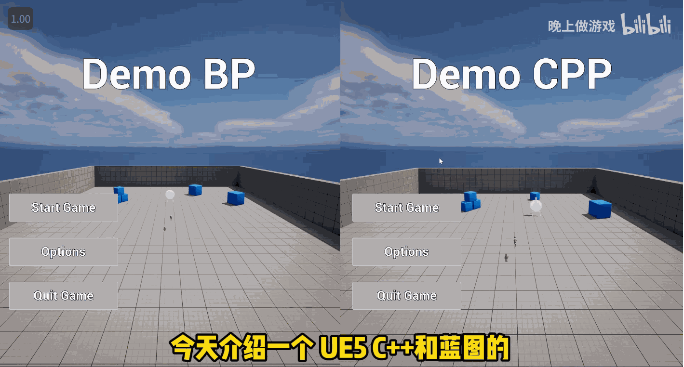

# 【UE5 C++】蓝图/C++完全对照项目 游戏公司程序新人作业

## 项目简介

本仓库旨在通过清晰的对照形式，帮助开发者尤其是游戏公司新人快速掌握UE5中蓝图与C++在实现相同功能时的差异与联系，助力新人更好地完成程序相关作业，提升对UE5开发的理解。

## 核心内容

视频及配套工程主要围绕以下方面展开：

1. **对照展示**
   直观呈现同一功能分别用蓝图和C++实现的具体代码与效果，让开发者清晰看到两者在实现方式上的异同。

2. **核心原理**
   深入解析蓝图与C++在UE5开发中的底层逻辑和交互方式，帮助开发者理解为何在不同场景下选择不同的开发方式，以及两者如何协同工作。

3. **代码实现**
   提供完整可运行的蓝图与C++代码示例，包括：

- 常见功能的蓝图实现步骤与代码
- 对应功能的C++实现代码及解释
- 两者在语法、结构上的对比分析

## 工程获取与使用

1. **环境要求**

- Unreal Engine 5.0+
- Visual Studio 2022（或 Rider 2024）

2. **下载地址**

- 完整工程：[获取链接](https://github.com/AstroWYH)

3. **快速启动**
   获取工程后，右键`.uproject`文件选择对应引擎版本，生成项目所需文件，点击运行即可查看蓝图与C++对照的演示效果。

## 适用人群

- 游戏公司程序新人
- 刚接触UE5开发，对蓝图和C++选择困惑的开发者
- 希望提升UE5开发技能，了解蓝图与C++差异的学习者
- 准备应聘游戏公司UE5开发岗位的求职者

## 相关资源

- 视频链接：[【UE5 C++】蓝图/C++完全对照项目 游戏公司程序新人作业](https://www.bilibili.com/video/BV1QsRVYvEcn/?spm_id_from=333.788.videopod.sections&vd_source=ab67845b846f1632f14b7e2c4a6c5935)
- 系列教程：查看作者其他UE5 C++教程（背包系统、网络同步、Shader开发等）
- 参考项目：作者推荐的UE5相关学习项目（如GAS相关项目、Mass框架项目等）

## 许可证

本工程基于MIT许可证开源，允许个人与商业项目自由使用、修改和分发，如需二次发布请注明原作者及视频来源。
</doubaocanvas>
